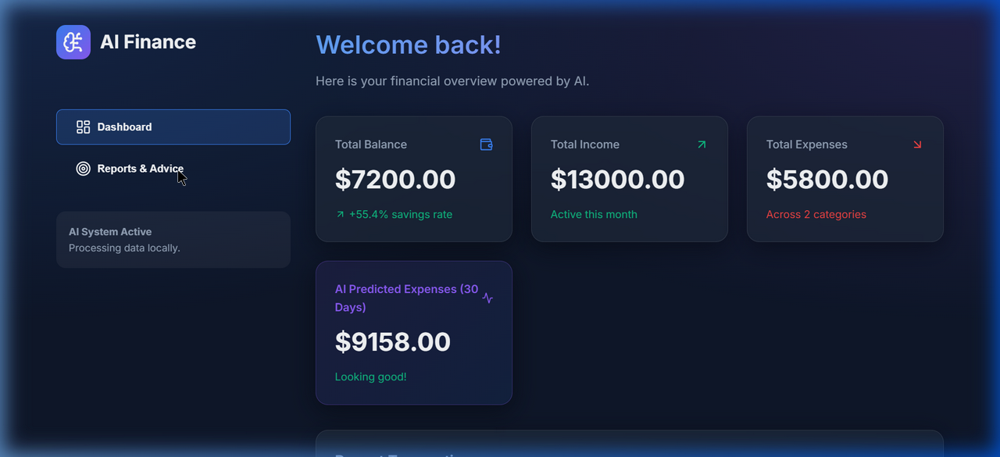

# AI Personal Finance Advisor System

An intelligent Personal Finance Advisor system that features automated expense categorization, budgeting recommendations, and predictive financial analytics. Built with React and Vite.

## Screenshots & Demo Video

### Actual Running Dashboard


### Walkthrough Demo Video
Below is a full walk-through demo video showing transaction addition, dashboard updates, and AI reports navigation:


## How to Run

1. Clone the repository:
   ```bash
   git clone https://github.com/peskhadar9-sudo/mk.git
   cd mk
   ```

2. Install dependencies:
   ```bash
   npm install
   ```

3. Run the development server:
   ```bash
   npm run dev
   ```

4. Open your browser and navigate to the local URL provided (usually `http://localhost:5173/`).

## Group Members (Group 2)

- Maxamed Naasir Cilmi
- Khadar C/raxmaan Xasan
- Maxamuud Cumar Daahir
- Mohamoud Mohamed Abdi
- Mustafe Mohamoud Ibrahim
- Hamse Kayse Omer
- Amiin Mohamoud Kosar 
- Salman Saed Hussein
